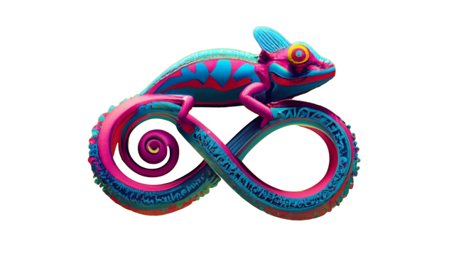
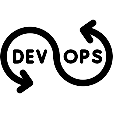
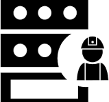
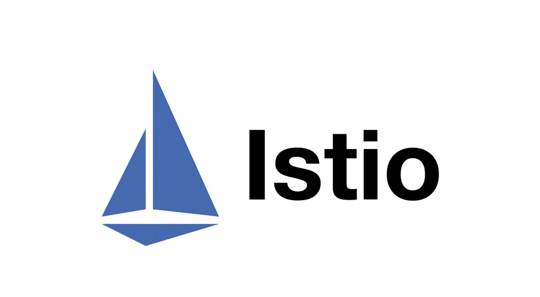

<!-- PROJECT TITLE -->
  <h1 align="center">30-Day-DevOps-Challenge</h1>
 <div id="header" align="center">
  
</div>
<h1 align="center">
 About
</h1>
<p align="center"> This repository is a 30-day introduction to DevOps journey. Inside, is a structured set of resources designed to make the learning experience both enjoyable and educational. Each day of the challenge is organized into a dedicated folder. Each day has a table with links to key components of the challenge:

</p>
<table border="1">
  <tr>
    <th width="150px">Component</th>
    <th>Description</th>
  </tr>
  <tr>
    <td>Notes</td>
    <td>
      <ul>
        <li>Notes on the day's topic, reading or watching learning resources.</li>
      </ul>
    </td>
  </tr>
    <tr>
    <td>Key Takeaways</td>
    <td>
      <ul>
        <li>Succinct, takeaways from the day's learning.</li>
      </ul>
    </td>
  </tr>
    <tr>
    <td>Tweet/X</td>
    <td>
      <ul>
        <li>Exploring the power of 'learning in public.' For each day, there's a curated tweet tagged with #30DaysOfDevOps, to share insights, questions, or simply celebrate progress with the DevOps community.</li>
      </ul>
    </td>
  </tr>
    <tr>
    <td>Blog Posts</td>
    <td>
      <ul>
        <li>Alongside the daily notes, short blog posts were written. These posts serve as a bridge between technical knowledge and everyday understanding.</li>
      </ul>
    </td>
  </tr>
    <tr>
    <td>Video Series</td>
    <td>
      <ul>
        <li>Complementing the blog posts, a video series that takes you on a storytelling journey through the world of DevOps. These videos serve as a fun and engaging way to solidify understanding of the topics discussed each day. They follow the Feynman technique, where complex ideas are made accessible through relatable narratives. (This video series is my "talking to a rubber duck 🦆 " method)</li>
      </ul>
    </td>
  </tr>
</table>

<p align="center"> So, if you find yourself exploring this repo and you prefer diving deep into notes, grabbing key takeaways, engaging with the community through tweets, reading friendly blog posts, or immersing yourself in storytelling videos, this repository offers a multi-faceted approach to gaining a foundational introduction to the DevOps process. Welcome aboard, and happy learning 🚀!</p>

### Table of Contents

<details>
<summary>30-Day-DevOps-Challenge</summary>

- [Andy-Mineo-Music](#andy-mineo-music)
- [Berlin-Through-Your-Eyes](#berlin-through-your-eyes)
- [Book-Collection](#book-collection)
- [US-President-Search-app](#us-president-search-app)
- [Zealands-landing-page](#zealands-landing-page)
</details>


<div style="display: flex; align-items: center;">

   ### Introduction to DevOps
 
</div>

<table border="1">
  <tr>
    <th>Day</th>
    <th>Content</th>
    <th>Summary</th>
    <th>Blog</th>
    <th>Video</th>
  </tr>
  <tr>
    <td>1</td>
    <td>
      <ul>
        <li>Notes</li>
        <li>Key Takeaway</li>
        <li>Learning Resources</li>
         <li><a href="https://twitter.com/sandraamsc">X about it</a></li>
      </ul>
    </td>
    <td>
      <li>
        What is DevOps?
      </li>
    </td>
    <td>
      <ul>
         <a href="https://github.com/sandramsc">Link to blog post</a>
      </ul>
    </td>
        <td>
      <ul>
        <a href="https://github.com/sandramsc">Link to video</a>
      </ul>
    </td>
  </tr>
</table>

<div style="display: flex; align-items: center;">

   ### Version Control with Git
   
</div>

<table border="1">
  <tr>
    <th>Day</th>
    <th>Content</th>
    <th>Summary</th>
    <th>Blog</th>
    <th>Video</th>
  </tr>
  <tr>
    <td>2</td>
    <td>
      <ul>
        <li>Notes</li>
        <li>Key Takeaway</li>
        <li>Learning Resources</li>
         <li><a href="https://twitter.com/sandraamsc">X about it</a></li>
      </ul>
    </td>
    <td>
      <li>
        Setting up repositories, branching etc.
      </li>
    </td>
    <td>
      <ul>
         <a href="https://github.com/sandramsc">Link to blog post</a>
      </ul>
    </td>
        <td>
      <ul>
        <a href="https://github.com/sandramsc">Link to video</a>
      </ul>
    </td>
  </tr>
</table>

<div style="display: flex; align-items: center;">

   ### Programming with Python
   
</div>

<table border="1">
  <tr>
    <th>Day</th>
    <th>Content</th>
    <th>Summary</th>
    <th>Blog</th>
    <th>Video</th>
  </tr>
  <tr>
    <td>3</td>
    <td>
      <ul>
        <li>Notes</li>
        <li>Key Takeaway</li>
        <li>Learning Resources</li>
         <li><a href="https://twitter.com/sandraamsc">X about it</a></li>
      </ul>
    </td>
    <td>
      <li>
        Basic data types, variables, functions etc.
      </li>
    </td>
    <td>
      <ul>
         <a href="https://github.com/sandramsc">Link to blog post</a>
      </ul>
    </td>
        <td>
      <ul>
        <a href="https://github.com/sandramsc">Link to video</a>
      </ul>
    </td>
  </tr>
</table>
<div style="display: flex; align-items: center;">

   ### Linux Basics (Operating Systems)
   
</div>

<table border="1">
  <tr>
    <th>Day</th>
    <th>Content</th>
    <th>Summary</th>
    <th>Blog</th>
    <th>Video</th>
  </tr>
  <tr>
    <td>4</td>
    <td>
      <ul>
        <li>Notes</li>
        <li>Key Takeaway</li>
        <li>Learning Resources</li>
         <li><a href="https://twitter.com/sandraamsc">X about it</a></li>
      </ul>
    </td>
    <td>
      <li>
        Essential Linux commands for directory operations etc.
      </li>
    </td>
    <td>
      <ul>
         <a href="https://github.com/sandramsc">Link to blog post</a>
      </ul>
    </td>
        <td>
      <ul>
        <a href="https://github.com/sandramsc">Link to video</a>
      </ul>
    </td>
  </tr>
</table>
<div style="display: flex; align-items: center;">

   ### Agile & Scrum
   
</div>

<table border="1">
  <tr>
    <th>Day</th>
    <th>Content</th>
    <th>Summary</th>
    <th>Blog</th>
    <th>Video</th>
  </tr>
  <tr>
    <td>5</td>
    <td>
      <ul>
        <li>Notes</li>
        <li>Key Takeaway</li>
        <li>Learning Resources</li>
         <li><a href="https://twitter.com/sandraamsc">X about it</a></li>
      </ul>
    </td>
    <td>
      <li>
         Essentials of package management.
      </li>
    </td>
    <td>
      <ul>
         <a href="https://github.com/sandramsc">Link to blog post</a>
      </ul>
    </td>
        <td>
      <ul>
        <a href="https://github.com/sandramsc">Link to video</a>
      </ul>
    </td>
  </tr>
</table>
<div style="display: flex; align-items: center;">

   ### Networking & Security
  
</div>

<table border="1">
  <tr>
    <th>Day</th>
    <th>Content</th>
    <th>Summary</th>
    <th>Blog</th>
    <th>Video</th>
  </tr>
  <tr>
    <td>6</td>
    <td>
      <ul>
        <li>Notes</li>
        <li>Key Takeaway</li>
        <li>Learning Resources</li>
         <li><a href="https://twitter.com/sandraamsc">X about it</a></li>
      </ul>
    </td>
    <td>
      <li>
        LAN, switches, routers, subnets etc.
      </li>
    </td>
    <td>
      <ul>
         <a href="https://github.com/sandramsc">Link to blog post</a>
      </ul>
    </td>
        <td>
      <ul>
        <a href="https://github.com/sandramsc">Link to video</a>
      </ul>
    </td>
  </tr>
</table>
<div style="display: flex; align-items: center;">

   ### Containers with Docker
   
</div>

<table border="1">
  <tr>
    <th>Day</th>
    <th>Content</th>
    <th>Summary</th>
    <th>Blog</th>
    <th>Video</th>
  </tr>
  <tr>
    <td>7</td>
    <td>
      <ul>
        <li>Notes</li>
        <li>Key Takeaway</li>
        <li>Learning Resources</li>
         <li><a href="https://twitter.com/sandraamsc">X about it</a></li>
      </ul>
    </td>
    <td>
      <li>
        Understanding Docker components, main commands etc.
      </li>
    </td>
    <td>
      <ul>
         <a href="https://github.com/sandramsc">Link to blog post</a>
      </ul>
    </td>
        <td>
      <ul>
        <a href="https://github.com/sandramsc">Link to video</a>
      </ul>
    </td>
  </tr>
</table>
<div style="display: flex; align-items: center;">

   ### Container Orchestration with Kubernetes
   
</div>

<table border="1">
  <tr>
    <th>Day</th>
    <th>Content</th>
    <th>Summary</th>
    <th>Blog</th>
    <th>Video</th>
  </tr>
  <tr>
    <td>8</td>
    <td>
      <ul>
        <li>Notes</li>
        <li>Key Takeaway</li>
        <li>Learning Resources</li>
         <li><a href="https://twitter.com/sandraamsc">X about it</a></li>
      </ul>
    </td>
    <td>
      <li>
        Kubernetes and container orchestration.
      </li>
    </td>
    <td>
      <ul>
         <a href="https://github.com/sandramsc">Link to blog post</a>
      </ul>
    </td>
        <td>
      <ul>
        <a href="https://github.com/sandramsc">Link to video</a>
      </ul>
    </td>
  </tr>
</table>
<div style="display: flex; align-items: center;">

   ### Infrastructure as Code with Terraform
   
</div>

<table border="1">
  <tr>
    <th>Day</th>
    <th>Content</th>
    <th>Summary</th>
    <th>Blog</th>
    <th>Video</th>
  </tr>
  <tr>
    <td>9</td>
    <td>
      <ul>
        <li>Notes</li>
        <li>Key Takeaway</li>
        <li>Learning Resources</li>
         <li><a href="https://twitter.com/sandraamsc">X about it</a></li>
      </ul>
    </td>
    <td>
      <li>
        Architecture, providers, resources, variables etc.
      </li>
    </td>
    <td>
      <ul>
         <a href="https://github.com/sandramsc">Link to blog post</a>
      </ul>
    </td>
        <td>
      <ul>
        <a href="https://github.com/sandramsc">Link to video</a>
      </ul>
    </td>
  </tr>
</table>
<div style="display: flex; align-items: center;">

   ### Build Automation - CI/CD with Jenkins
   
</div>

<table border="1">
  <tr>
    <th>Day</th>
    <th>Content</th>
    <th>Summary</th>
    <th>Blog</th>
    <th>Video</th>
  </tr>
  <tr>
    <td>10</td>
    <td>
      <ul>
        <li>Notes</li>
        <li>Key Takeaway</li>
        <li>Learning Resources</li>
         <li><a href="https://twitter.com/sandraamsc">X about it</a></li>
      </ul>
    </td>
    <td>
      <li>
         Setting up cloud, installing plugins etc.
      </li>
    </td>
    <td>
      <ul>
         <a href="https://github.com/sandramsc">Link to blog post</a>
      </ul>
    </td>
        <td>
      <ul>
        <a href="https://github.com/sandramsc">Link to video</a>
      </ul>
    </td>
  </tr>
</table>
<div style="display: flex; align-items: center;">

   ### Cloud Computing platforms (AWS)
   
</div>

<table border="1">
  <tr>
    <th>Day</th>
    <th>Content</th>
    <th>Summary</th>
    <th>Blog</th>
    <th>Video</th>
  </tr>
  <tr>
    <td>11</td>
    <td>
      <ul>
        <li>Notes</li>
        <li>Key Takeaway</li>
        <li>Learning Resources</li>
         <li><a href="https://twitter.com/sandraamsc">X about it</a></li>
      </ul>
    </td>
    <td>
      <li>
        Introduction to cloud computing etc.
      </li>
    </td>
    <td>
      <ul>
         <a href="https://github.com/sandramsc">Link to blog post</a>
      </ul>
    </td>
        <td>
      <ul>
        <a href="https://github.com/sandramsc">Link to video</a>
      </ul>
    </td>
  </tr>
</table>

<div style="display: flex; align-items: center;">

   ### Monitoring & Observability (Prometheus)
   
</div>

<table border="1">
  <tr>
    <th>Day</th>
    <th>Content</th>
    <th>Summary</th>
    <th>Blog</th>
    <th>Video</th>
  </tr>
  <tr>
    <td>12</td>
    <td>
      <ul>
        <li>Notes</li>
        <li>Key Takeaway</li>
        <li>Learning Resources</li>
         <li><a href="https://twitter.com/sandraamsc">X about it</a></li>
      </ul>
    </td>
    <td>
      <li>
        Setting up Prometheus and Grafana etc.
      </li>
    </td>
    <td>
      <ul>
         <a href="https://github.com/sandramsc">Link to blog post</a>
      </ul>
    </td>
        <td>
      <ul>
        <a href="https://github.com/sandramsc">Link to video</a>
      </ul>
    </td>
  </tr>
</table>
<div style="display: flex; align-items: center;">

   ### Configuration Management (Ansible)
   
</div>

<table border="1">
  <tr>
    <th>Day</th>
    <th>Content</th>
    <th>Summary</th>
    <th>Blog</th>
    <th>Video</th>
  </tr>
  <tr>
    <td>13</td>
    <td>
      <ul>
        <li>Notes</li>
        <li>Key Takeaway</li>
        <li>Learning Resources</li>
         <li><a href="https://twitter.com/sandraamsc">X about it</a></li>
      </ul>
    </td>
    <td>
      <li>
         Tasks, playbooks, modules etc.
      </li>
    </td>
    <td>
      <ul>
         <a href="https://github.com/sandramsc">Link to blog post</a>
      </ul>
    </td>
        <td>
      <ul>
        <a href="https://github.com/sandramsc">Link to video</a>
      </ul>
    </td>
  </tr>
</table>
<div style="display: flex; align-items: center;">

   ### Server Management
  
</div>

<table border="1">
  <tr>
    <th>Day</th>
    <th>Content</th>
    <th>Summary</th>
    <th>Blog</th>
    <th>Video</th>
  </tr>
  <tr>
    <td>9</td>
    <td>
      <ul>
        <li>Notes</li>
        <li>Key Takeaway</li>
        <li>Learning Resources</li>
         <li><a href="https://twitter.com/sandraamsc">X about it</a></li>
      </ul>
    </td>
    <td>
      <li>
        Writing and executing simple Bash scripts.
      </li>
    </td>
    <td>
      <ul>
         <a href="https://github.com/sandramsc">Link to blog post</a>
      </ul>
    </td>
        <td>
      <ul>
        <a href="https://github.com/sandramsc">Link to video</a>
      </ul>
    </td>
  </tr>
</table>

<div style="display: flex; align-items: center;">

   ### Service Mesh (Istio)
   
</div>

<table border="1">
  <tr>
    <th>Day</th>
    <th>Content</th>
    <th>Summary</th>
    <th>Blog</th>
    <th>Video</th>
  </tr>
  <tr>
    <td>30</td>
    <td>
      <ul>
        <li>Notes</li>
        <li>Key Takeaway</li>
        <li>Learning Resources</li>
         <li><a href="https://twitter.com/sandraamsc">X about it</a></li>
      </ul>
    </td>
    <td>
      <li>
        The value of DevOps.
      </li>
    </td>
    <td>
      <ul>
         <a href="https://github.com/sandramsc">Link to blog post</a>
      </ul>
    </td>
        <td>
      <ul>
        <a href="https://github.com/sandramsc">Link to video</a>
      </ul>
    </td>
  </tr>
</table>


## How to use the repository

Run the following commands on your terminal:

**Step #1** - Clone the project

```bash
$ git clone https://github.com/sandramsc/Exploring-DevOps-30-day-challenge.git
```

**Step #2**

```bash
Navigate to desired day i.e (Day 1) folder and to review the days content.
```

---
  <h6 align="center">If you found this project helpful, please consider giving it a star 🌟!</h6>
 <h6 2 align="center">
   <p>Should you enjoy utilizing this project, you're welcome to buy me a latte macchiato ☕️ as a gesture of support.</p>
  <a href="https://www.buymeacoffee.com/skogsglaenta" target="_blank"></a>
    <br />
 </h6>

<p align="center"> Crafted with ❤️ by <a href="https://github.com/sandramsc">Sandra Ashipala</a> </p>
