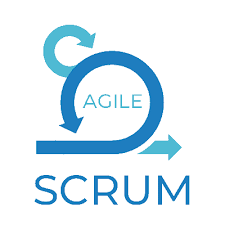

<!-- PROJECT TITLE -->
<h1 align="center">15-Days-DevOps-Challenge</h1>

  

<h1 align="center">
 About
</h1>

 This repository is a 15-day introduction to DevOps journey. Inside, is a structured set of resources designed to make the learning experience both enjoyable and educational. Each day of the challenge is organized into a dedicated folder. Each day has a table with links to key components of the challenge:

<table border="1">
  <tr>
    <th width="150px">Component</th>
    <th>Description</th>
  </tr>
  <tr>
    <td>Notes</td>
    <td>
      <ul>
        <li>Notes on the day's topic, reading or watching learning resources.</li>
      </ul>
    </td>
  </tr>
  <tr>
    <td>Key Takeaways</td>
    <td>
      <ul>
        <li>Succinct, takeaways from the day's learning.</li>
      </ul>
    </td>
  </tr>
  <tr>
    <td>Tweet/X</td>
    <td>
      <ul>
        <li>Exploring the power of 'learning in public.' For each day, there's a curated tweet tagged with #15DaysOfDevOps, to share insights, questions, or simply celebrate progress with the DevOps community.</li>
      </ul>
    </td>
  </tr>
  <tr>
    <td>Video Series</td>
    <td>
      <ul>
        <li>Complementing the notes, a video series that takes you on a storytelling journey through DevOps. These videos serve as a fun and engaging way to solidify understanding of the topics discussed each day. They follow the Feynman technique, where complex ideas are made accessible through relatable narratives. (This video series is my "talking to a rubber duck 🦆 " method)</li>
      </ul>
    </td>
  </tr>
</table>

 So, if you find yourself exploring this repo and you prefer diving deep into notes, grabbing key takeaways, engaging with the community through tweets, or immersing yourself in storytelling videos, this repository offers a multi-faceted approach to gaining a foundational introduction to the DevOps process. Welcome aboard, and happy learning 🚀!

### Table of Contents

 15-Days-DevOps-Challenge

- [Introduction to DevOps](#introduction-to-devops)
- [Version Control (Git)](#version-control-git)

   ### Introduction to DevOps
 

<table border="1">
  <tr>
    <th>Day</th>
    <th>Content</th>
    <th>Summary</th>
    <th>Video</th>
  </tr>
  <tr>
    <td>1</td>
    <td>
      <ul>
        <li>Notes</li>
        <li>Key Takeaway</li>
        <li>Learning Resources</li>
         <li><a href="https://twitter.com/sandraamsc">X about it</a></li>
      </ul>
    </td>
    <td>
      <li>
        What is DevOps?
      </li>
    </td>
    <td>
      <ul>
        <a href="https://github.com/sandramsc">Link to video</a>
      </ul>
    </td>
  </tr>
</table>

   ### Version Control (Git)
   

<table border="1">
  <tr>
    <th>Day</th>
    <th>Content</th>
    <th>Summary</th>
    <th>Video</th>
  </tr>
  <tr>
    <td>2</td>
    <td>
      <ul>
        <li>Notes</li>
        <li>Key Takeaway</li>
        <li>Learning Resources</li>
         <li><a href="https://twitter.com/sandraamsc">X about it</a></li>
      </ul>
    </td>
    <td>
      <li>
        Setting up repositories, branching etc.
      </li>
    </td>
    <td>
      <ul>
        <a href="https://github.com/sandramsc">Link to video</a>
      </ul>
    </td>
  </tr>
</table>

   ### Python
   

<table border="1">
  <tr>
    <th>Day</th>
    <th>Content</th>
    <th>Summary</th>
    <th>Video</th>
  </tr>
  <tr>
    <td>3</td>
    <td>
      <ul>
        <li>Notes</li>
        <li>Key Takeaway</li>
        <li>Learning Resources</li>
         <li><a href="https://twitter.com/sandraamsc">X about it</a></li>
      </ul>
    </td>
    <td>
      <li>
        Basic data types, variables, functions etc.
      </li>
    </td>
    <td>
      <ul>
        <a href="https://github.com/sandramsc">Link to video</a>
      </ul>
    </td>
  </tr>
</table>

   ### Linux Basics (Operating Systems)
   

<table border="1">
  <tr>
    <th>Day</th>
    <th>Content</th>
    <th>Summary</th>
    <th>Video</th>
  </tr>
  <tr>
    <td>4</td>
    <td>
      <ul>
        <li>Notes</li>
        <li>Key Takeaway</li>
        <li>Learning Resources</li>
         <li><a href="https://twitter.com/sandraamsc">X about it</a></li>
      </ul>
    </td>
    <td>
      <li>
        Essential Linux commands for directory operations etc.
      </li>
    </td>
    <td>
      <ul>
        <a href="https://github.com/sandramsc">Link to video</a>
      </ul>
    </td>
  </tr>
</table>

   ### Agile & Scrum
   

<table border="1">
  <tr>
    <th>Day</th>
    <th>Content</th>
    <th>Summary</th>
    <th>Video</th>
  </tr>
  <tr>
    <td>5</td>
    <td>
      <ul>
        <li>Notes</li>
        <li>Key Takeaway</li>
        <li>Learning Resources</li>
         <li><a href="https://twitter.com/sandraamsc">X about it</a></li>
      </ul>
    </td>
    <td>
      <li>
         The role of Agile & Scrum in DevOps.
      </li>
    </td>
    <td>
      <ul>
        <a href="https://github.com/sandramsc">Link to video</a>
      </ul>
    </td>
  </tr>
</table>

   ### Network Security
  

<table border="1">
  <tr>
    <th>Day</th>
    <th>Content</th>
    <th>Summary</th>
    <th>Video</th>
  </tr>
  <tr>
    <td>6</td>
    <td>
      <ul>
        <li>Notes</li>
        <li>Key Takeaway</li>
        <li>Learning Resources</li>
         <li><a href="https://twitter.com/sandraamsc">X about it</a></li>
      </ul>
    </td>
    <td>
      <li>
        LAN, switches, routers, subnets, firewalls.
      </li>
    </td>
    <td>
      <ul>
        <a href="https://github.com/sandramsc">Link to video</a>
      </ul>
    </td>
  </tr>
</table>

   ### Containers & Docker
   

<table border="1">
  <tr>
    <th>Day</th>
    <th>Content</th>
    <th>Summary</th>
    <th>Video</th>
  </tr>
  <tr>
    <td>7</td>
    <td>
      <ul>
        <li>Notes</li>
        <li>Key Takeaway</li>
        <li>Learning Resources</li>
         <li><a href="https://twitter.com/sandraamsc">X about it</a></li>
      </ul>
    </td>
    <td>
      <li>
        Introduction to Docker containers, images, and volumes.
      </li>
    </td>
    <td>
      <ul>
        <a href="https://github.com/sandramsc">Link to video</a>
      </ul>
    </td>
  </tr>
</table>

   ### CI/CD Pipelines
   

<table border="1">
  <tr>
    <th>Day</th>
    <th>Content</th>
    <th>Summary</th>
    <th>Video</th>
  </tr>
  <tr>
    <td>8</td>
    <td>
      <ul>
        <li>Notes</li>
        <li>Key Takeaway</li>
        <li>Learning Resources</li>
         <li><a href="https://twitter.com/sandraamsc">X about it</a></li>
      </ul>
    </td>
    <td>
      <li>
        Fundamentals of continuous integration and deployment.
      </li>
    </td>
    <td>
      <ul>
        <a href="https://github.com/sandramsc">Link to video</a>
      </ul>
    </td>
  </tr>
</table>

   ### Infrastructure as Code (IaC)
   

<table border="1">
  <tr>
    <th>Day</th>
    <th>Content</th>
    <th>Summary</th>
    <th>Video</th>
  </tr>
  <tr>
    <td>9</td>
    <td>
      <ul>
        <li>Notes</li>
        <li>Key Takeaway</li>
        <li>Learning Resources</li>
         <li><a href="https://twitter.com/sandraamsc">X about it</a></li>
      </ul>
    </td>
    <td>
      <li>
        Introduction to Terraform and CloudFormation basics.
      </li>
    </td>
    <td>
      <ul>
        <a href="https://github.com/sandramsc">Link to video</a>
      </ul>
    </td>
  </tr>
</table>

   ### Monitoring & Logging
   

<table border="1">
  <tr>
    <th>Day</th>
    <th>Content</th>
    <th>Summary</th>
    <th>Video</th>
  </tr>
  <tr>
    <td>10</td>
    <td>
      <ul>
        <li>Notes</li>
        <li>Key Takeaway</li>
        <li>Learning Resources</li>
         <li><a href="https://twitter.com/sandraamsc">X about it</a></li>
      </ul>
    </td>
    <td>
      <li>
        Setting up Prometheus and Grafana for system monitoring.
      </li>
    </td>
    <td>
      <ul>
        <a href="https://github.com/sandramsc">Link to video</a>
      </ul>
    </td>
  </tr>
</table>

   ### Cloud Computing Basics
   

<table border="1">
  <tr>
    <th>Day</th>
    <th>Content</th>
    <th>Summary</th>
    <th>Video</th>
  </tr>
  <tr>
    <td>11</td>
    <td>
      <ul>
        <li>Notes</li>
        <li>Key Takeaway</li>
        <li>Learning Resources</li>
         <li><a href="https://twitter.com/sandraamsc">X about it</a></li>
      </ul>
    </td>
    <td>
      <li>
        Overview of AWS services and cloud deployment.
      </li>
    </td>
    <td>
      <ul>
        <a href="https://github.com/sandramsc">Link to video</a>
      </ul>
    </td>
  </tr>
</table>

   ### Kubernetes Basics
   

<table border="1">
  <tr>
    <th>Day</th>
    <th>Content</th>
    <th>Summary</th>
    <th>Video</th>
  </tr>
  <tr>
    <td>12</td>
    <td>
      <ul>
        <li>Notes</li>
        <li>Key Takeaway</li>
        <li>Learning Resources</li>
         <li><a href="https://twitter.com/sandraamsc">X about it</a></li>
      </ul>
    </td>
    <td>
      <li>
        Introduction to Kubernetes clusters and deployment.
      </li>
    </td>
    <td>
      <ul>
        <a href="https://github.com/sandramsc">Link to video</a>
      </ul>
    </td>
  </tr>
</table>

   ### Security Best Practices
   

<table border="1">
  <tr>
    <th>Day</th>
    <th>Content</th>
    <th>Summary</th>
    <th>Video</th>
  </tr>
  <tr>
    <td>13</td>
    <td>
      <ul>
        <li>Notes</li>
        <li>Key Takeaway</li>
        <li>Learning Resources</li>
         <li><a href="https://twitter.com/sandraamsc">X about it</a></li>
      </ul>
    </td>
    <td>
      <li>
        Secure coding, vulnerability scanning, and secrets management.
      </li>
    </td>
    <td>
      <ul>
        <a href="https://github.com/sandramsc">Link to video</a>
      </ul>
    </td>
  </tr>
</table>

   ### Final Project & Wrap-up
   

<table border="1">
  <tr>
    <th>Day</th>
    <th>Content</th>
    <th>Summary</th>
    <th>Video</th>
  </tr>
  <tr>
    <td>14</td>
    <td>
      <ul>
        <li>Notes</li>
        <li>Key Takeaway</li>
        <li>Final project instructions</li>
        <li><a href="https://twitter.com/sandraamsc">X about it</a></li>
      </ul>
    </td>
    <td>
      <li>
        Putting it all together in a final project.
      </li>
    </td>
    <td>
      <ul>
        <a href="https://github.com/sandramsc">Link to video</a>
      </ul>
    </td>
  </tr>
</table>

<table border="1">
  <tr>
    <th>Day</th>
    <th>Content</th>
    <th>Summary</th>
    <th>Video</th>
  </tr>
  <tr>
    <td>15</td>
    <td>
      <ul>
        <li>Notes</li>
        <li>Key Takeaway</li>
        <li>Celebration and next steps</li>
        <li><a href="https://twitter.com/sandraamsc">X about it</a></li>
      </ul>
    </td>
    <td>
      <li>
        Recap and future learning paths.
      </li>
    </td>
    <td>
      <ul>
        <a href="https://github.com/sandramsc">Link to video</a>
      </ul>
    </td>
  </tr>
</table>
